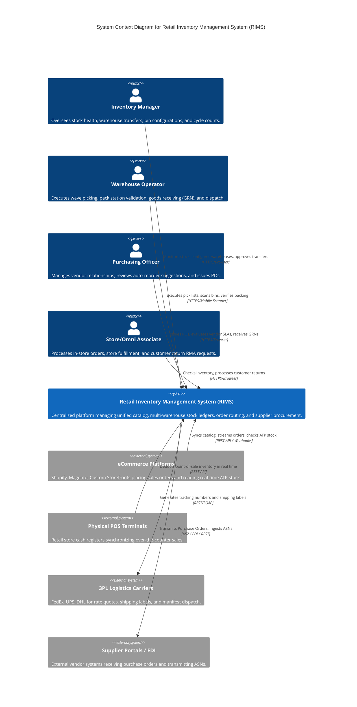
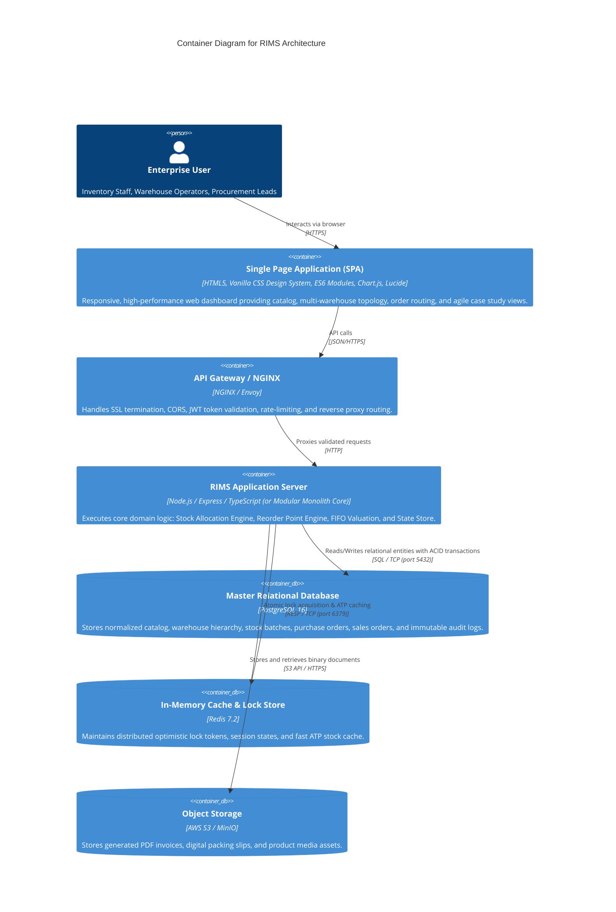
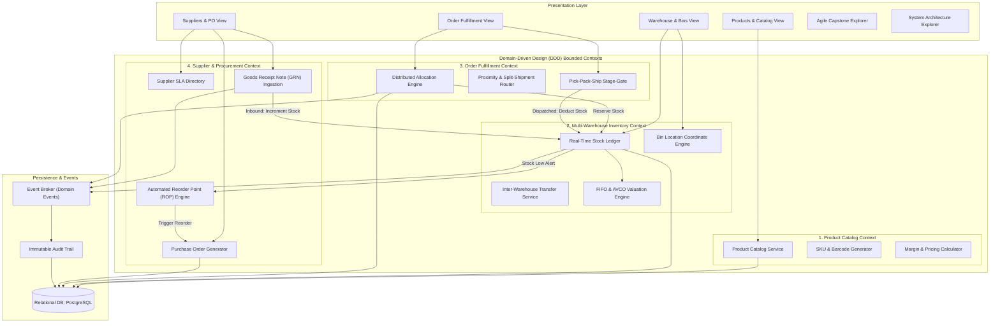
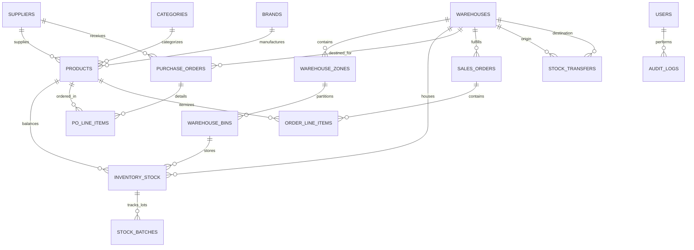

# Retail Inventory Management System (RIMS)
## Enterprise System Architecture & Engineering Blueprint
**Agile Capstone Case Study — Comprehensive Technical Architecture**

---

### Executive Summary & System Vision
The **Retail Inventory Management System (RIMS)** is a distributed, web-based, multi-tenant inventory control, omnichannel order fulfillment, and supplier relationship platform designed for modern multi-channel retailers. The architecture addresses the core operational challenges of high-volume retail:
- Real-time, distributed inventory visibility across multiple physical distribution centers and store backrooms.
- Elimination of stockouts, overselling, and inventory phantom records through optimistic concurrency control and strict inventory reservation locking.
- Intelligent multi-node order allocation that minimizes split-shipments, optimizes freight transit zones, and respects FIFO batch expiration.
- Automated Procure-to-Pay workflows driven by dynamic Reorder Point ($ROP$) calculations with supplier lead-time tracking.
- An end-to-end Agile Capstone delivery framework spanning **8 Epics and 15 Sprints**.

---

## 1. Architectural Style & Design Principles

### 1.1 Architectural Pattern: Modular Event-Driven Hexagonal Monolith
To combine high engineering velocity with clean bounded contexts, RIMS utilizes a **Modular Event-Driven Architecture (Hexagonal / Ports-and-Adapters)**:
- **Loose Coupling & Strict Boundaries**: The codebase is partitioned into distinct Domain Contexts (Catalog, Multi-Warehouse Inventory, Order Fulfillment, Procurement/Suppliers, Reporting/Auditing). Cross-domain interactions occur strictly via defined domain service interfaces or asynchronous domain events.
- **Microservices-Ready**: Each domain module encapsulates its own business logic, transactional invariants, and repository interfaces, allowing future extraction into standalone microservices without domain refactoring.
- **Event-Driven Integration**: Key business state transitions (e.g., `OrderPlaced`, `StockAllocated`, `GoodsReceived`, `ThresholdCrossed`) emit strongly-typed Domain Events across an in-process or distributed event bus (Redis Pub/Sub or Apache Kafka), decoupling read-side projection updates from transactional writes.
- **Clean Architecture Layers**:
  - **Domain Core**: Pure business entities, aggregates, value objects, and business rules (zero external dependencies).
  - **Application / Use Cases**: Orchestration services, command/query handlers, workflow engines (allocation, ROP, valuation).
  - **Infrastructure / Adapters**: Database persistence (PostgreSQL/SQLite via Knex/Prisma/SQL), caching (Redis), external 3PL carrier APIs, and notification systems.
  - **Presentation / API**: RESTful OpenAPI endpoints, GraphQL interfaces, and modern Single Page Application (SPA) client.

```
+-----------------------------------------------------------------------------------+
|                            PRESENTATION LAYER                                      |
|   +---------------------------------------------------------------------------+   |
|   |   Web SPA Frontend (Modern Reactive UI, Glassmorphism, Chart.js, Lucide)  |   |
|   +---------------------------------------------------------------------------+   |
|                                     | (HTTPS / REST / WebSocket)                  |
+-------------------------------------v---------------------------------------------+
|                           API GATEWAY / REVERSE PROXY                             |
|        Rate Limiting | JWT Auth / RBAC | Request Tracing | SSL Termination        |
+-------------------------------------+---------------------------------------------+
|                            APPLICATION LAYER                                      |
|  +-------------------+  +-------------------+  +-------------------+  +---------+  |
|  | Catalog & PIM     |  | Inventory & Bins  |  | Order Allocation  |  | SRM & PO|  |
|  | Service           |  | Ledger Service    |  | Engine            |  | Service |  |
|  +-------------------+  +-------------------+  +-------------------+  +---------+  |
|            \                      |                      /                 /       |
|             \                     |                     /                 /        |
|  +------------------------------------------------------------------------------+  |
|  |                        EVENT BUS (In-Process / Redis / Kafka)                 |  |
|  +------------------------------------------------------------------------------+  |
+-------------------------------------+---------------------------------------------+
|                              DOMAIN CORE LAYER                                    |
|   Aggregates: Product | StockRecord | Warehouse | PurchaseOrder | SalesOrder     |
|   Invariants: Non-negative ATP, Immutable SKU, Atomic Allocation, Lot Tracking    |
+-------------------------------------+---------------------------------------------+
|                           INFRASTRUCTURE LAYER                                    |
|   +--------------------+  +--------------------+  +----------------------------+  |
|   | PostgreSQL 16      |  | Redis 7.2 Cache    |  | Object Storage (S3 / MinIO)|  |
|   | (Relational/JSONB) |  | & Distributed Lock |  | (Invoices, Packing Slips)  |  |
|   +--------------------+  +--------------------+  +----------------------------+  |
+-----------------------------------------------------------------------------------+
```

---

## 2. C4 Architecture Specification

### 2.1 C4 Level 1: System Context Diagram
The System Context defines the actors and external enterprise integrations interacting with RIMS:



---

### 2.2 C4 Level 2: Container Diagram
The Container Diagram illustrates the high-level technology choices and runtime processes:



---

### 2.3 C4 Level 3: Component Diagram (Core Business Domains)



---

## 3. Domain-Driven Design (DDD) & Bounded Contexts

RIMS establishes 4 primary business bounded contexts plus supporting governance contexts:

### 3.1 Context 1: Product Information Management (PIM) & Catalog
- **Aggregate Root**: `Product`
- **Entities & Value Objects**: `ProductVariant`, `Category`, `Brand`, `Money` (Cost, Price), `Dimensions` (Length, Width, Height, Weight), `Barcode` (EAN-13/UPC-A).
- **Invariants**:
  - SKU must be unique across the tenant and follow formatting `[CATEGORY]-[BRAND]-[SEQ]`.
  - Selling price must exceed cost price; gross margin percentage is strictly enforced.
  - Active products cannot be hard-deleted if referenced in stock ledgers or open orders (soft deletion only).

### 3.2 Context 2: Multi-Warehouse Inventory & Bin Topology
- **Aggregate Root**: `Warehouse`, `StockLedgerRecord`
- **Entities & Value Objects**: `WarehouseZone` (e.g., Bulk, Fast-Pick, Cold-Storage, Quarantine), `BinLocation` (format: `Zone-Aisle-Shelf-Bin`, e.g., `A-02-04-B`), `StockBatch` (Lot Number, Expiry Date, Inbound Date, Unit Cost).
- **Core Metrics**:
  - **On Hand ($SOH$)**: Physical units inside the warehouse bins.
  - **Allocated ($RES$)**: Units reserved for approved sales orders currently in picking or packing.
  - **Available to Promise ($ATP$)**: $ATP = SOH - RES$.
  - Invariant: $ATP \ge 0$. Under no circumstance can $RES > SOH$ (prevents overselling).

### 3.3 Context 3: Order Routing & Fulfillment (OMS / WMS)
- **Aggregate Root**: `SalesOrder`
- **Entities & Value Objects**: `OrderItem`, `AllocationPlan`, `PickList`, `Package`, `TrackingDetails`, `CustomerShippingAddress`.
- **Fulfillment Lifecycle States**:
  $$\text{Draft} \longrightarrow \text{Pending Allocation} \xrightarrow{\text{Allocation Engine}} \text{Allocated} \longrightarrow \text{Picking} \longrightarrow \text{Packing} \longrightarrow \text{Dispatched} \longrightarrow \text{Delivered}$$
- **Invariants**:
  - Stock allocation locks inventory atomically.
  - Orders cannot advance to "Dispatched" without an assigned carrier tracking number and validated packing verification.
  - Advancing to "Dispatched" permanently clears the reservation and decrements physical $SOH$.

### 3.4 Context 4: Supplier Relationship Management (SRM) & Procure-to-Pay
- **Aggregate Root**: `Supplier`, `PurchaseOrder`
- **Entities & Value Objects**: `POLineItem`, `GoodsReceiptNote (GRN)`, `InspectionResult`, `PaymentTerms`.
- **Invariants**:
  - PO transitions: $\text{Draft} \rightarrow \text{Sent} \rightarrow \text{Partially Received} \rightarrow \text{Completed}$.
  - Inbound GRN receiving automatically creates batch-specific stock records in designated receiving/staging bins with exact cost layering for inventory valuation.

---

## 4. Core Business Algorithms & Mathematical Specifications

### 4.1 Distributed Order Allocation & Multi-Warehouse Routing Algorithm
When an omnichannel order arrives with multiple items, the allocation engine determines the optimal warehouse nodes to minimize freight cost, prevent split-shipments, and maximize fulfillment speed.

#### Objective Function:
$$\min \sum_{w \in W} \left( C_{\text{zone}}(w, \text{Dest}) + P_{\text{split}} \cdot \mathbb{I}_{w > 1} + \frac{1}{\text{StockRatio}(w)} \cdot \lambda \right)$$

Where:
- $C_{\text{zone}}(w, \text{Dest})$: Shipping zone cost penalty proportional to geographic distance between Warehouse $w$ and customer delivery address.
- $P_{\text{split}}$: High penalty constant assigned if an order must be split across more than 1 distribution center.
- $\text{StockRatio}(w) = \frac{\sum_{i \in \text{Order}} \min(S_{w, i}, Q_i)}{\sum Q_i}$: Percentage of order items warehouse $w$ can fulfill.
- $\lambda$: Tie-breaking weight favoring facilities with higher available capacity.

#### Algorithm Pseudo-code:
```typescript
function allocateSalesOrder(order, warehouses, stockLedger) {
  // Step 1: Filter warehouses with ATP > 0 for at least 1 line item
  const candidates = warehouses.filter(wh => hasAnyAvailableStock(wh, order.items));

  // Step 2: Check for Single-Source Solution (Zero Split-Shipment)
  const fullFulfillmentNodes = candidates.filter(wh => canFulfillCompleteOrder(wh, order.items));

  if (fullFulfillmentNodes.length > 0) {
    // Sort by proximity distance to destination
    fullFulfillmentNodes.sort((a, b) => distance(a, order.address) - distance(b, order.address));
    return executeAtomicAllocation(order, fullFulfillmentNodes[0]);
  }

  // Step 3: Multi-Node Partial Allocation (Minimum Split Shipments)
  let remainingItems = [...order.items];
  const selectedAllocations = [];

  while (remainingItems.length > 0) {
    let bestWarehouse = null;
    let maxCoveredCount = 0;

    for (const wh of candidates) {
      const coverable = calculateCoverableCount(wh, remainingItems);
      if (coverable > maxCoveredCount) {
        maxCoveredCount = coverable;
        bestWarehouse = wh;
      }
    }

    if (!bestWarehouse) throw new OutOfStockException("Order cannot be fulfilled from current warehouse network");

    const allocatedFromWh = allocatePartial(bestWarehouse, remainingItems);
    selectedAllocations.push({ warehouse: bestWarehouse, items: allocatedFromWh });
    remainingItems = computeRemainder(remainingItems, allocatedFromWh);
  }

  return selectedAllocations;
}
```

---

### 4.2 Dynamic Reorder Point ($ROP$) & Safety Stock Model
To ensure automated replenishment without manual oversight, RIMS continuously calculates the $ROP$ for each product at each warehouse:

$$ROP = (d \times L) + SS$$

Where:
- $d$: Average Daily Demand (units sold per day over moving 30-day window).
- $L$: Supplier Lead Time (in days).
- $SS$: Safety Stock, computed using service level confidence factor $Z$ and demand variance:

$$SS = Z \times \sqrt{L \times \sigma_d^2 + d^2 \times \sigma_L^2}$$

- For 95% service level ($Z = 1.645$); for 99% service level ($Z = 2.326$).
- **Trigger Rule**: Whenever $(SOH - RES + \text{InboundPO}) \le ROP$, an automated purchase order draft is generated.

---

### 4.3 Inventory Valuation Engine: FIFO vs AVCO Comparison
RIMS implements dual valuation models to comply with GAAP / IFRS accounting standards:

1. **First-In, First-Out (FIFO) Cost Layering**:
   - Stock is tracked in discrete chronological batches: $\text{Batch}_1(Q_1, C_1), \text{Batch}_2(Q_2, C_2), \dots$.
   - When an order consumes quantity $Q$, it exhausts oldest cost layers first.
   - Cost of Goods Sold ($\text{COGS}$) reflects actual historical cost of the oldest inventory.

2. **Moving Weighted Average Cost (AVCO)**:
   - Recalculated immediately upon every Inbound Goods Receipt Note (GRN):
   $$C_{\text{new\_avg}} = \frac{(SOH_{\text{prior}} \times C_{\text{prior\_avg}}) + (Q_{\text{received}} \times C_{\text{invoice}})}{SOH_{\text{prior}} + Q_{\text{received}}}$$

---

## 5. Concurrency Control & Race Condition Prevention

In high-concurrency retail environments (e.g., flash sales, holiday traffic surges), multiple orders competing for the final units of inventory can cause double-selling if not guarded.

### 5.1 Optimistic Concurrency Control (OCC) with Versioning
Every row in the `inventory_stock` table contains an integer `version` column:

```sql
UPDATE inventory_stock
SET 
    on_hand = on_hand - :qty,
    reserved = reserved + :qty,
    version = version + 1,
    updated_at = CURRENT_TIMESTAMP
WHERE 
    product_id = :productId 
    AND warehouse_id = :warehouseId 
    AND (on_hand - reserved) >= :qty 
    AND version = :expectedVersion;
```
- If the row count returned is `0`, a concurrent transaction modified the record. The application retries with exponential backoff up to 3 times before returning a `409 Conflict`.

### 5.2 Distributed Locks via Redis (Redlock Pattern)
For multi-item orders requiring cross-table atomic reservation:
- Acquire distributed mutex lock on key `lock:stock:{warehouseId}:{productId}` with a 1500ms TTL.
- Execute validation and update inside a PostgreSQL transaction (`ISOLATION LEVEL READ COMMITTED`).
- Release lock safely using a Lua script ensuring token ownership.

---

## 6. Database Schema & Data Architecture (ERD)

### 6.1 Entity-Relationship Diagram (Mermaid)



### 6.2 Data Dictionary (Key Tables)
1. **`products`**: ID, SKU (unique index), barcode (EAN-13), name, description, category_id, brand_id, cost_price, selling_price, reorder_point, max_stock, unit, weight_kg, dimensions, is_active, created_at, updated_at.
2. **`warehouses`**: ID, code (unique), name, type (Central DC, Regional Hub, Retail Store), address, city, state, postal_code, total_sqft, max_bin_capacity, is_active.
3. **`warehouse_bins`**: ID, warehouse_id, zone_id, bin_code (e.g., `A-01-02-C`), max_weight_kg, is_occupied.
4. **`inventory_stock`**: ID, product_id, warehouse_id, bin_id, on_hand, reserved, version, last_counted_at.
5. **`stock_batches`**: ID, stock_id, lot_number, unit_cost, initial_qty, remaining_qty, expiry_date, received_at.
6. **`purchase_orders`**: ID, po_number, supplier_id, destination_warehouse_id, status (Draft, Sent, Partially Received, Completed), order_date, expected_date, total_cost.
7. **`po_line_items`**: ID, po_id, product_id, ordered_qty, received_qty, unit_cost.
8. **`sales_orders`**: ID, order_number, channel (Web, POS, Amazon, Mobile), customer_name, shipping_address, allocated_warehouse_id, status (Pending, Allocated, Picking, Packing, Dispatched, Delivered), total_amount, carrier, tracking_number.
9. **`order_line_items`**: ID, order_id, product_id, requested_qty, allocated_qty, unit_price.
10. **`stock_transfers`**: ID, transfer_number, from_warehouse_id, to_warehouse_id, status (In-Transit, Completed, Cancelled), tracking_number, initiated_at, completed_at.
11. **`audit_logs`**: ID, action_type, user_name, entity_name, entity_id, description, ip_address, created_at.

---

## 7. RESTful API Contract & Specifications

All API routes follow standard RESTful semantics under `/api/v1` with JSON payloads:

| Method | Endpoint | Description | Auth Roles |
|---|---|---|---|
| `GET` | `/api/v1/products` | Paginated product catalog search & filter | All Authenticated |
| `POST` | `/api/v1/products` | Create new SKU with barcode validation | Admin, Inventory Mgr |
| `GET` | `/api/v1/inventory/stock` | Query ATP stock across all warehouses | All Authenticated |
| `POST` | `/api/v1/inventory/adjust` | Manual cycle count stock variance adjustment | Inventory Mgr |
| `POST` | `/api/v1/inventory/transfers`| Initiate inter-warehouse stock transfer | Inventory Mgr |
| `POST` | `/api/v1/inventory/transfers/:id/receive` | Ingest transfer stock at destination | Warehouse Op |
| `GET` | `/api/v1/orders` | Query sales orders by fulfillment status | All Authenticated |
| `POST` | `/api/v1/orders` | Ingest omnichannel sales order | Store Associate, API |
| `POST` | `/api/v1/orders/:id/allocate` | Run intelligent allocation algorithm | System / Ops Lead |
| `PATCH`| `/api/v1/orders/:id/status` | Advance pick -> pack -> dispatch workflow | Warehouse Op |
| `GET` | `/api/v1/suppliers` | List approved vendors with SLA ratings | Purchasing, Admin |
| `POST` | `/api/v1/procurement/po` | Create purchase order | Purchasing Officer |
| `POST` | `/api/v1/procurement/po/:id/grn` | Receive goods receipt note & add stock | Warehouse Op |

---

## 8. Non-Functional Requirements & Security Architecture

### 8.1 Security & Role-Based Access Control (RBAC)
RIMS enforces strict least-privilege RBAC using standard roles:
- **System Administrator**: Full configuration, user role management, system settings.
- **Inventory Manager**: SKU creation, stock adjustments, bin mappings, warehouse transfers.
- **Warehouse Operator**: Barcode scanning, wave picking, pack station validation, inbound GRN receipt.
- **Purchasing Officer**: Vendor evaluations, PO generation, supplier pricing contracts.
- **Auditor**: Read-only access to transaction ledgers, valuation reports, and immutable audit logs.

### 8.2 Audit Trail & Compliance
Every stock movement, status advancement, or configuration change creates an immutable append-only record in `audit_logs`:
$$\text{Audit Record} = \langle \text{Timestamp}, \text{Actor}, \text{ActionType}, \text{EntityRef}, \text{BeforePayload}, \text{AfterPayload}, \text{IPAddress} \rangle$$

### 8.3 Performance & Scalability Targets
- **Catalog Search Latency**: $< 35\text{ms}$ at 95th percentile for 100,000 SKUs via B-tree and trigram indexes.
- **Stock Reservation Latency**: $< 20\text{ms}$ under 500 concurrent checkout transactions/sec.
- **System Availability SLA**: 99.95% uptime with active-passive multi-AZ database clustering and multi-instance container load balancing.
